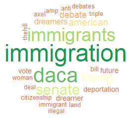
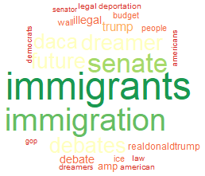

#Twitter Analysis from the Past 30 Days#
### Looking at how conversations and short terms opinions change after major news events and spikes in interest on topics related to immigration###

In this initial analysis we gather 22,000 tweets from 3 different, 3 day periods over the last 30 days, Feb. 12 - 14th, Feb. 17 - 19th, and Feb 28th - Mar. 2nd. For context, on Feb. 13th Trump tweeted about new immigration and trade related pushes, on Feb. 18th, Trump blew up yet another DACA deal, and on the week of Feb 28th - Mar. 2nd the mayor of Oakland warned about ICE raids. The goal was to look at the day before, during, and after a spike in immigration conversations occurred during a high volatility, medium volatility, and low volatility week respectively, to understand the sentiment and topics being discussed over time. 

We looked at both the sentiment of single word usage as well as sentence wide sentiment and topics, including both retweets and completely unique tweets. This helped us understand whether retweets from "power users" changed sentiment of the conversation more than organic discussions. 

#Findings#

##1##
###Conversations Do Change Quickly###

We can immediately see that not only is the conversation around retweets slightly different, but the conversation from day to day changes quickly when major events come out. 

###Retweets vs. Unique###
 

###Day 1 vs. Day 2 vs. Day 3###
  

##2##
###More Volatile Weeks Have More Volatile Sentiment Changes###

From this initial analysis we can't see if specific people's opinions are changing, but we can see that the sentiment and conversation is changing. Most notably, after a strong spike in negative related or positive related tweets, there will be an immediate rebound to the opposite emotion. 

###Week 1 - Most Volatile vs. Week 3 - Least Volatile###
 

##3##
###Discussions Around Immigration can be Nuanced###

Each day the conversations being had around immigration aren't always around one subject, or around immigration in general. For example, look at the first day. We can see conversations around DACA and border security, as well as political opinions about the recipients of DACA. We can even see that there are conversations around proposals and opinions from different political leaders, or even how immigration relates to more entertainment related things like the Olympics or other major events. 

###Day 1 Topics###

#Conclusion and Next Steps#

This gives us insight into how conversations progress on social media sites, however, there are many other points of interest and study that can give us a better understanding of how this analysis can help us in the future. Some ideas include finding out how conversations progress on popular retweets to see if users opinions do, in fact, change. We can also tell what links are being shared most frequently and where different types of people are getting their news based on various topics or sentiment. We can even tell how sentiments change geographically. 

It is likely that during the more major events over the past couple years sentiments and opinions have changed more drastically, so the next step would be to look further back in time to determine the effects. 
